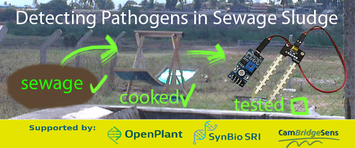

## Detecting Pathogens in Sewage Sludge

## Synopsis

CDI’s piloted sewage system uniquely aims to be a sustainable and profitable system where products derived from sewage can be sold back into the community at prices that can compete with the current market.
The present state of the 2016 piloted sewage system is that there is a flow of sewage, albeit with unpredictable biogas and fertiliser production, the device for which is still in prototyping stages. Further understanding of the sewage system is needed to diagnose problems and measure the effectiveness of designs.
The solar concentrator aims to ‘cook away’ harmful pathogens in the sewage for conversion into marketable fertiliser. The cooking process is measured by taking infrared thermal readings of the outside of the drum container. However, there is a need to monitor the environmental conditions within the drum and test the resulting sludge for pathogens.
We are looking to create a product that can rapidly report on the fertilizing quality and safety of heat-treated sewage sludge.

## Background Research
Living bacteria exhibits behaviour that can distinguish it from dead bacteria, which range from respiration, to growth, to consumption. These characteristics can be detected by, for example, detecting changes in oxygen levels, observing presence of specific type of bacteria under a petri dish, or observing absorption with flourescence microscopy. 

Movement is one of the behaviours of live microorganisms. There are a few scientific papers which use movement to quanitify the levels of bacteria, and generally they conclude that the more observed movement, the more number of bacteria is present. The method they use is speckle decorrelation, where a speckle pattern on a sample is observed with a digital camera and analysed for decorrelation - that is, how much movement there is in the video feed. The method is able to work with little pre-processing of the sample and can produce results immediately (compared to the long wait times needed for chemical or biological processes used in other bacteria sensing methods). 
This is relevant to the need because it is important to quantify how well the solar cooker is killing bacteria, and not necessarily the specific strand of bacteria. Ideally the kind of relationship sought after is the % of bacteria killed vs. the time in the solar-cooker.

## Design Proposal
The overall design is simply a laser and camera, with focussing lenses and a computer: the laser shines a speckle pattern onto a sample, and the camera records the area on the sample and quantifies the visual movement over 20 seconds. Convex lenses are required to focus the camera onto the spot on the sample, and a computer to perform analysis.

## Software

The role of the software is to accept input video feed and output a number quantifying the movement within the video. The aim is that this number will increase as more live, moving, bacteria is present in the video.

The implementation is as follows:
- we use OpenCV libraries:
- we use a python script to do image analysis
- we output the moving average value

run the command in the directory with the source files: (after 'make' for basicDemo)
python differencesMovingAvg.py | ./basicDemo

Explain functionality of software components (if any) as concisely as possible, developers should be able to figure out how your project solves their problem by looking at the code example. Ideally, this should be pseudo code or an abstract graphical representation of your code e.g entity relationship diagram. Consider adding a screenshot of your User Interface.

## Hardware

# Mechanical
Camera focussing system consists of two convex lenses, a WaterScope microscope kit base, a raspberry pi camera module. This was put together using a constructable metal frame. 
The lenses used were: 
1) 25mm diameter 12mm focus convex lens as the 'objective lens' nearest to the sample
2) 15mm diameter, 20mm focus, conves lens for the 'optical lens' nearest to the camera
These were separated by 32mm. 
Attaching the lenses to the frame was challenging, so we used small 15cm by 4cm plates of 3mm acrylic with holes in the centre to glue the lenses on to. 
The WaterScope Microscope 3d printed base is a useful way to move the sample by micro-meter steps. 

# Electrical
A small breadboard to connect the laser

Explain how the hardware components (if any) of your project function as concisely as possible, including a short description of fabrication and assembly. Component suppliers and part numbers should be provided separately in a bill of materials, in a 'Hardware Folder'.

## Installation, Maintenance and Testing Guide

Provide instructions on usage, describe a test scheme and show how to run the tests with code and hardware configuration examples with some representative results.

## License

A short snippet describing the license (MIT, Apache, etc.) you have chosen to use

## Sources and References

A simple and rapid method for detecting living microorganisms in food  using laser speckle decorrelation
Jonghee Yoon, KyeoReh Lee, and YongKeun Park
https://arxiv.org/ftp/arxiv/papers/1603/1603.07343.pdf
